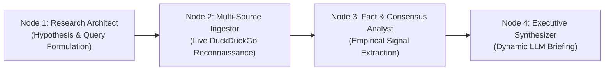

# ✦ Argus • Autonomous Multi-Agent Research Intelligence

An autonomous multi-agent research platform built with **LangGraph**, **FastAPI**, and **Ollama (Llama 3)**. Argus deploys a collaborative four-agent think-tank that conducts live web reconnaissance, extracts quantitative empirical signals, and dynamically writes publication-grade intelligence briefings.

---

## 🏛️ Multi-Agent Architecture



1. **Research Architect (Planner)**: Formulates multi-vector inquiry angles based on topic and selected focus mode (*Comprehensive, Executive, Technical Radar, Risks*).
2. **Multi-Source Ingestor (Researcher)**: Queries live web feeds via DuckDuckGo and ingests deep page extracts with metadata (URL, domain, snippet).
3. **Fact & Consensus Analyst**: Audits source convergence and extracts empirical data points (percentages, market sizing, metrics).
4. **Executive Synthesizer (Writer)**: Composes an in-depth intelligence dossier in Markdown with complete structural autonomy.

---

## ✨ Features

- **Editorial Think-Tank UI**: Luxurious, distraction-free aesthetic with warm obsidian tones, champagne accents, and serif typography (*Newsreader* + *Plus Jakarta Sans*).
- **Interactive StateGraph Visualizer**: Real-time 4-node pipeline cards with active pulsing deliberation rings and status telemetry stream.
- **Factual Metrics Ribbon**: Real-time counts of ingested sources, search vectors deployed, and parsed empirical data points.
- **Corroborated Source Cards**: Direct citation pills with domain tags and external links to verified sources.
- **Export Suite**: One-click Markdown copy, `.md` file download, and print-to-PDF formatting.
- **Resilient Dual-Engine Backend**:
  - Auto-detects local Ollama binary on Windows/Linux and launches the background daemon automatically.
  - Generous timeouts for local laptop inference.
  - Optional cloud fallback via Groq (`GROQ_API_KEY`) or OpenAI (`OPENAI_API_KEY`).

---

## 🚀 Quick Start

### 1. Prerequisites
- Python 3.10+
- [Ollama](https://ollama.com/download) with Llama 3 installed:
  ```bash
  ollama run llama3
  ```

### 2. Installation
Clone the repository and set up a virtual environment:

```bash
# Create and activate virtual environment
python -m venv .venv
.venv\Scripts\activate       # Windows PowerShell
# source .venv/bin/activate  # macOS / Linux

# Install dependencies
pip install -r requirements.txt
pip install ddgs
```

### 3. Run Application
```bash
python app.py
```

Visit **`http://127.0.0.1:8003`** in your browser.

---

## 🛠️ Tech Stack

- **Orchestration**: [LangGraph](https://github.com/langchain-ai/langgraph) StateGraph
- **Backend API**: [FastAPI](https://fastapi.tiangolo.com/), Uvicorn, Jinja2
- **Local Inference**: [Ollama](https://ollama.ai) (`llama3`)
- **Web Reconnaissance**: [ddgs](https://github.com/deedy5/duckduckgo_search) (DuckDuckGo Search)
- **Frontend**: Vanilla HTML5/CSS3, Marked.js, Google Fonts (*Newsreader, Plus Jakarta Sans, JetBrains Mono*)
